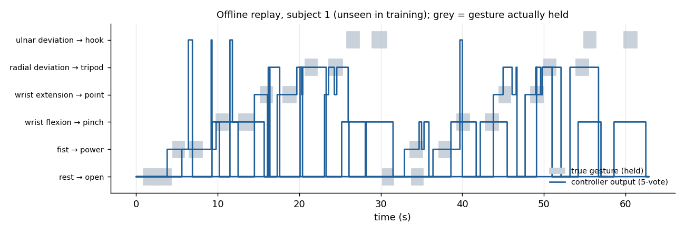

# EMG-Controlled Prosthetic Hand — Prototype (ANN + Arduino)

A five-finger prosthetic hand driven by forearm muscle signals (EMG): a pattern-recognition
model decides which grip the user intends, and an Arduino moves five finger servos.

> **Status: not tested on hardware.** The 2020 hand and its circuit are no longer available and
> no photographs survive. Everything below was verified in software only: the controller is
> evaluated offline on recorded EMG, and the Arduino sketch compiles but has not been run on a
> board. Treat it as a design you can build, not a demonstrated device.



## How it works

```
8-channel forearm EMG ─► every 100 ms, last 200 ms window ─► MAV, RMS, WL, ZC, SSC per channel
  ─► MLP gesture classifier ─► 5-decision majority vote ─► grip preset
  ─► serial "G thumb index middle ring little" ─► Arduino ─► 5 servos
```

| Detected gesture | Grip | Servo angles (thumb, index, middle, ring, little) |
|---|---|---|
| rest | open | 0 0 0 0 0 |
| fist | power | 180 180 180 180 180 |
| wrist flexion | pinch | 150 150 0 0 0 |
| wrist extension | point | 180 0 180 180 180 |
| radial deviation | tripod | 150 150 150 0 0 |
| ulnar deviation | hook | 0 120 120 120 120 |

The training gestures include wrist movements a hand without a wrist cannot copy, so — as in
pattern-recognition prostheses — each muscle pattern *selects* a grip. The mapping is a design
choice and is easy to change (`GRIPS` in `controller/hand_controller.py`); angles must be
calibrated for the actual servos and linkages.

The feature set and classifier are the best configuration found in the companion study
[emg-gesture-recognition-mfcc-vs-td-features](https://github.com/Moustafa-Afara/emg-gesture-recognition-mfcc-vs-td-features).

## Offline evaluation (software only)

Data: UCI *EMG data for gestures* (36 people, MYO armband, 8 channels, ~1 kHz). The controller
is trained on 30 people and replayed, window by window and in time order, on the complete
recordings of the other 6 — repeated for all 6 groups, so every person is tested once without
having been seen in training.

| Measure | Result (mean ± SD over the 6 groups) |
|---|---|
| Window accuracy on held gestures, raw | 81.7 % ± 4.1 |
| … after 5-decision majority vote | **84.4 % ± 4.1** |
| Decision latency | ≈ 400 ms (200 ms window + 2 voting steps of 100 ms) |
| Grip commands sent | ≈ 47 per minute, including the pauses between gestures |

Per-group logs: `results/replay_all_groups.log`. Chance is 16.7 %.

What this does **not** show: how a real hand behaves (servo speed, grip force, battery, the
user's own EMG and electrode placement), or how often the hand would do the wrong thing in daily
use. The command rate is high because the hand keeps reacting in the pauses between gestures,
where the data carry no label; a real device would need a rest/confidence threshold. Accuracy
also varies strongly between people — in the figure above, this person's *ulnar deviation* is
mostly read as *wrist flexion*, so the hook grip becomes a pinch.

## Quick start

```bash
git clone https://github.com/Moustafa-Afara/emg-prosthetic-hand-prototype-ann-arduino.git
cd emg-prosthetic-hand-prototype-ann-arduino
pip install -r requirements.txt
# data: https://archive.ics.uci.edu/dataset/481/emg+data+for+gestures (17 MB), unzip into controller/
cd controller
python hand_controller.py replay --data EMG_data_for_gestures-master --test-subjects 1 2 3 4 5 6 \
       --figure ../docs/replay_timeline.png
python hand_controller.py train  --data EMG_data_for_gestures-master --model model.joblib
# with a board flashed with arduino/prosthetic_hand (untested):
python hand_controller.py serial --model model.joblib --port COM3 \
       --demo-file EMG_data_for_gestures-master/01/1_raw_data_13-12_22.03.16.txt
```

**Arduino** (`arduino/prosthetic_hand/prosthetic_hand.ino`): Uno/Nano, servo signals on pins
3, 5, 6, 9, 10, 115 200 baud, line protocol `G a1 a2 a3 a4 a5` → reply `OK …` / `ERR …`. Power the
servos from a separate 5–6 V supply with a common ground. Compiles with the Arduino AVR core
1.8.19 and Servo 1.2.2 (5.3 kB flash, 16 %); not run on a board.

## The 2020 prototype (`matlab_2020/`)

The original project (report: `docs/report_ar.pdf`; data-flow diagram: `docs/data_flow_2020.jpg`)
recorded EMG through a custom analogue front end (its report references the TL081 op-amp), extracted
spectral features in MATLAB, classified five finger movements with a pattern-recognition network
(`patternnet`) and sent commands to an Arduino over serial. Its five example recordings (one per
movement, 1 000 samples each) are in `matlab_2020/data/`; they came from a public EMG dataset on
Kaggle whose exact name and sampling rate were not recorded.

Problems found in the 2020 code, and what this folder changes:

| 2020 version | Now |
|---|---|
| Each recording loaded 10 times and only the first copy rectified → 50 "samples" but only **10 distinct** (2 per class); the network was trained and tested on the same 50 | Each recording loaded once and cut into 10 windows → 50 distinct windows; train/validation/test split |
| Title and report describe MFCC; the code uses four spectral features, two with misleading names (`FMD` = ½ total Welch power, `MFMD` = ½ summed FFT magnitude, `FR` = min/max FFT magnitude) | Same features, comments corrected |
| Command = class digit glued to a feature value (e.g. "1"+"0.84" → 10.84); the Arduino kept one digit → servo angle **0–9°** | Command `G a1 … a5` with full 0–180° angles; class *k* closes finger *k* |
| Servo on pin 1 (the serial TX line), an uninitialised radio object, 1-s `readString()` delay per command, compiled `.hex` files committed | New sketch: pins 3/5/6/9/10, no radio, non-blocking line parser, sources only |

The feature scripts run in MATLAB and GNU Octave 8.4 (checked); `train_and_command.m` needs
MATLAB's Deep Learning Toolbox and was not re-run. Even fixed, five recordings (one per
movement, from one source) cannot show that the classifier generalises — which is why the
controller above is trained and evaluated on 36 people instead.

## Credits and licence

- Code: MIT (see `LICENSE`).
- Gesture data: N. Krilova, I. Kastalskiy, V. Kazantsev, V. Makarov, S. Lobov, *EMG Data for
  Gestures*, UCI Machine Learning Repository, 2018, https://doi.org/10.24432/C5ZP5C (CC BY 4.0).
- TD features: Hudgins, Parker and Scott, IEEE Trans. Biomed. Eng., 1993.
- Arduino Servo library: https://github.com/arduino-libraries/Servo

**Author:** Moustafa Afara — signal processing and pattern recognition (audio, biosignals, vision).
